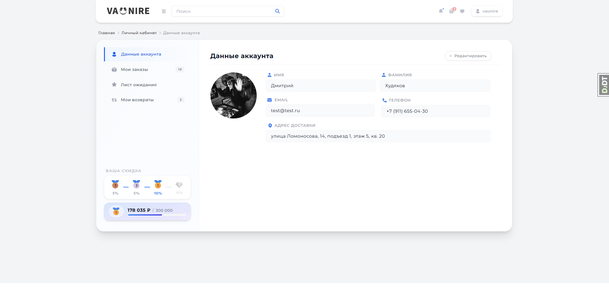
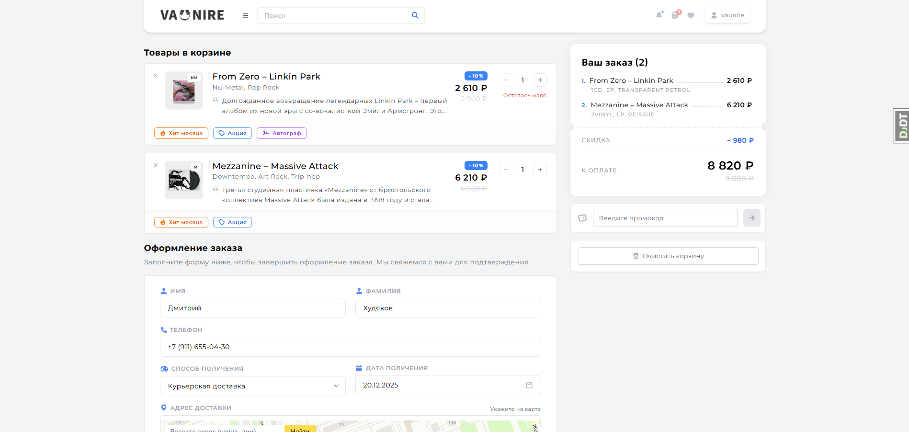
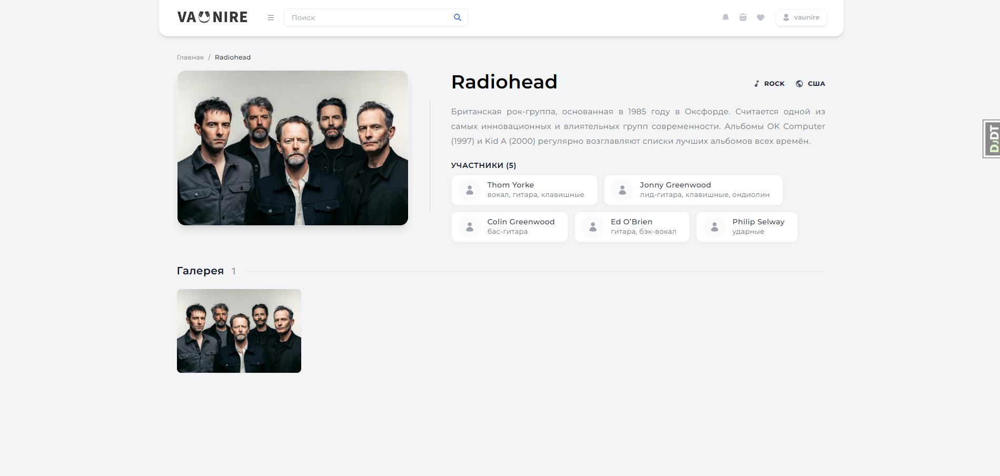

# Vaunire

Vaunire — это современная e-commerce платформа для продажи музыкальных альбомов на разных носителях, построенная на Django 5 и Tailwind CSS. Проект включает в себя каталог товаров, систему корзины, управление заказами, профили пользователей и интеграцию с платежными системами.

## 📸 Скриншоты

Все скриншоты интерфейса доступны в папке [`assets/`](assets/).

<details>
  <summary>Главные страницы</summary>
  
  
  
  
  
  
</details>

<details>
  <summary>Регистрация / Вход</summary>

  
  
</details>

<details>
  <summary>Админка</summary>

  
</details>

## 🚀 Технологический стек

- **Backend:** [Django 5.2](https://www.djangoproject.com/)
- **Frontend:** [Tailwind CSS](https://tailwindcss.com/) (через `django-tailwind`)
- **Database:** [PostgreSQL 16](https://www.postgresql.org/)
- **Caching:** [Redis](https://redis.io/)
- **Admin UI:** [Django Unfold](https://github.com/unfoldadmin/django-unfold)
- **Containerization:** [Docker](https://www.docker.com/) & [Docker Compose](https://docs.docker.com/compose/)
- **Payments:** [Stripe](https://stripe.com/)
- **Maps:** Yandex Maps API

## 📂 Структура проекта

```text
vaunire/
├── _config/            # Основная конфигурация проекта
├── _tailwind/          # Конфигурация Tailwind CSS
├── apps/               # Приложения
│   ├── accounts/       # Пользователи, авторизация, профили
│   ├── cart/           # Логика корзины
│   ├── catalog/        # Товары, Исполнители, Жанры, Типы носителей...
│   ├── orders/         # Обработка и хранение заказов
│   └── promotions/     # Система скидок и купонов
├── static/             # Собранная статика (production)
├── static_dev/         # Исходные статические файлы для разработки
├── templates/          # HTML шаблоны
├── utils/              # Вспомогательные функции и классы
├── manage.py           # Django CLI
├── Dockerfile          # Конфигурация образа приложения
└── docker-compose.yml  # Конфигурация сервисов (Web, DB, Redis, Nginx)
```

## 🛠 Установка и запуск

### 1. Подготовка окружения
Склонируйте репозиторий и создайте файл `.env` на основе примера:
```bash
cp .env.example .env
```
Настройте переменные окружения (БД, Секретный ключ, Stripe API и т.д.).

### 2. Запуск через Docker (Рекомендуется)
Проект полностью готов к запуску в контейнерах:
```bash
docker compose up --build
```
Это поднимет все необходимые сервисы:
- **web:** Django приложение;
- **db:** Базу данных PostgreSQL 16;
- **redis:** Сервер кэширования;
- **nginx:** Прокси-сервер для отдачи статики и медиа.

### 3. Локальный запуск (без Docker)

**Предварительные требования:**
- Python 3.11+
- PostgreSQL
- Node.js & npm (необходимы для сборки Tailwind CSS)

**Шаги установки:**
1. **Установите зависимости:**
   ```bash
   python -m venv .venv
   source .venv/bin/activate  # На Windows: .venv\Scripts\activate
   pip install -r requirements.txt
   ```
2. **Настройте БД:** Убедитесь, что PostgreSQL запущен и создана база данных, указанная в `.env`.
3. **Запустите миграции:**
   ```bash
   python manage.py migrate
   ```
4. **Установка зависимостей Tailwind:**
   ```bash
   python manage.py tailwind install
   ```
5. **Запустите сервер:**
   Для полноценной разработки потребуется два терминала:

   **Терминал 1 (Django Server):**
   ```bash
   python manage.py runserver
   ```

   **Терминал 2 (Tailwind Watcher - автосборка стилей):**
   ```bash
   python manage.py tailwind start
   ```

## 🛡 Администрирование
Для доступа к панели управления создайте суперпользователя:
```bash
python manage.py createsuperuser
```
Панель доступна по адресу `/admin/`. Благодаря теме **Unfold**, интерфейс адаптирован для удобной работы.

## 💳 Интеграции
- **Stripe:** Используется для эмуляции карточных платежей. Выбрана из-за удобного API и доступного Sandbox-режима для разработчиков (без необходимости регистрации юр.лица). Настройте `STRIPE_SECRET_KEY` и `STRIPE_WEBHOOK_SECRET` для работы.
- **Yandex Maps:** Используется в оформлении заказов для выбора пунктов выдачи или адреса. Требуется JS API-ключ.

---
